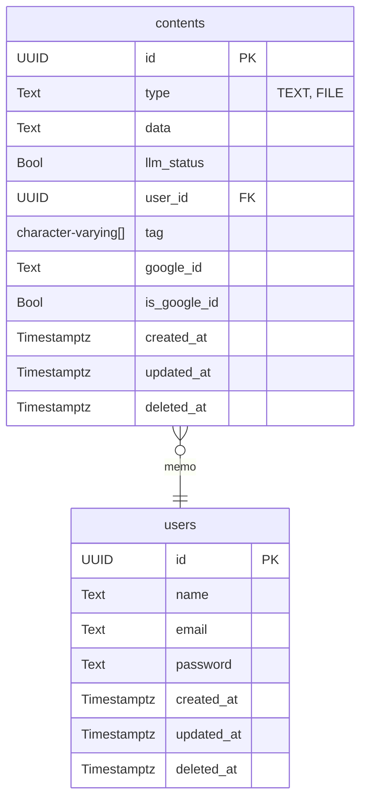

# ERD

```mermaid
erDiagram
"users"{
  UUID id PK
  Text name
  Text email
  Text password
  Timestamptz created_at
  Timestamptz updated_at
  Timestamptz deleted_at
}

"contents"{
  UUID id PK
  Text type "TEXT, FILE"
  Text data
  Bool llm_status
  UUID user_id FK
  character-varying[] tag
  Text google_id
  Bool is_google_id
  Timestamptz created_at
  Timestamptz updated_at
  Timestamptz deleted_at
}

"contents" }o--|| "users" :memo
```