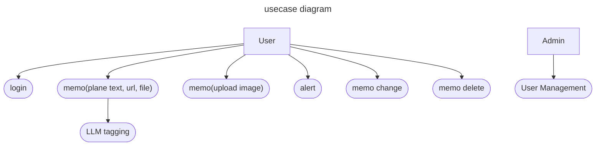

# usecase diagram

```mermaid
---
title: usecase diagram
---
flowchart
  User
  Admin
  
  User --> feat01([login])
  User --> feat02(["memo(plane text, url, file)"])
  User --> feat03(["memo(upload image)"])
  User --> feat05(["alert"])
  User --> feat07(["memo change"])
  User --> feat08(["memo delete"])

  feat02 --> feat04(["LLM tagging"])
  Admin --> feat06(["User Management"])

```